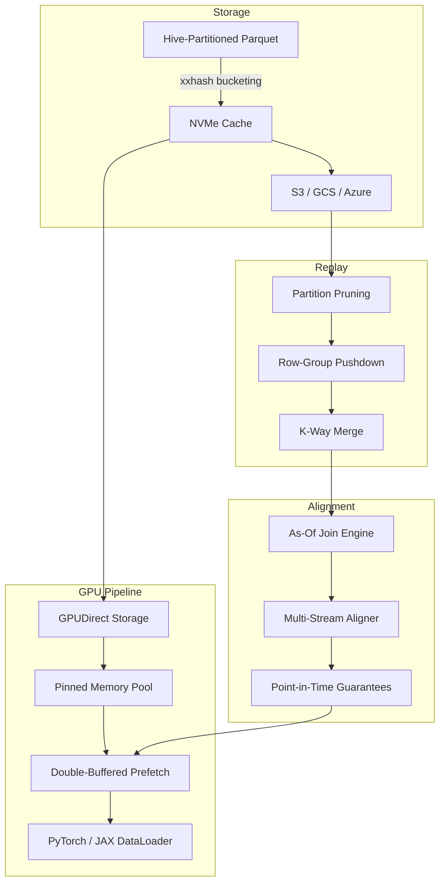

<p align="center">
  <strong>FlowState</strong><br>
  <em>Temporal alignment and GPU-accelerated data feeding for quantitative ML</em>
</p>

<p align="center">
  <a href="https://github.com/RyanJHamby/flowstate/actions/workflows/ci.yml"></a>
  <a href="LICENSE"></a>
  <a href="https://www.python.org/downloads/"></a>
  <a href="https://pypi.org/project/flowstate/"></a>
</p>

---

FlowState is a Python library for building point-in-time correct feature pipelines over market data. It joins heterogeneous streams — trades, quotes, bars — into aligned tensors at nanosecond precision, with native GPU data feeding for ML training workloads.

Built for production environments where look-ahead bias is a showstopper and pandas doesn't scale.

## The Problem

Quantitative ML models consume multiple data streams that arrive at different frequencies and with different latencies. Aligning them correctly means:

- A trade at `t` should see the most recent quote **as of `t`**, not a future one
- Stale data beyond a tolerance window should be nulled, not silently forward-filled
- Alignment must be per-symbol — AAPL quotes should never bleed into MSFT rows
- The result needs to land on a GPU without copying through Python

Most teams solve this with ad-hoc pandas merges, which are slow, error-prone, and disconnected from the training loop. FlowState handles it end-to-end.

## Architecture



## Key Features

| Capability | Description |
|---|---|
| **As-of joins** | Backward, forward, and nearest temporal joins with configurable tolerance and per-symbol grouping |
| **Multi-stream alignment** | Join any number of secondary streams onto a primary timeline in a single call |
| **No look-ahead bias** | Backward joins are the default — each row sees only data available at its timestamp |
| **Three-level pruning** | Hive partition elimination, Parquet row-group statistics, column projection |
| **K-way merge** | Globally time-ordered iteration across arbitrarily many files without full materialization |
| **GPU data path** | GPUDirect Storage (kvikio) with automatic CPU fallback for dev/CI |
| **ML DataLoaders** | Native PyTorch `IterableDataset` and JAX iterator adapters |
| **Cloud storage** | fsspec backends for S3, GCS, and Azure with NVMe LRU caching |

## Installation

```bash
pip install flowstate
```

```bash
# Optional extras
pip install flowstate[gpu]     # kvikio + cupy for GPUDirect Storage
pip install flowstate[aws]     # S3 via s3fs
pip install flowstate[gcs]     # Google Cloud Storage via gcsfs
pip install flowstate[dev]     # ruff, mypy, pytest, coverage
```

## Usage

### Align trades with quotes (no look-ahead bias)

```python
from flowstate.prism.alignment import TemporalAligner

aligner = TemporalAligner(
    primary_type="trade",
    secondary_specs={
        "quote": ["bid_price", "ask_price", "bid_size", "ask_size"],
    },
    tolerance_ns=5_000_000_000,  # reject quotes older than 5s
)

aligner.add_data("trade", trade_table)
aligner.add_data("quote", quote_table)

aligned, stats = aligner.flush()
# aligned is a pa.Table: trades + quote_bid_price, quote_ask_price, ...
# Every row is point-in-time correct
```

### Low-level as-of join

```python
from flowstate.prism.alignment import as_of_join, AsOfConfig

# Each trade gets the most recent quote as of its timestamp
result, stats = as_of_join(trades, quotes, on="timestamp", by="symbol")

# Forward join for label generation (e.g., mid-price 1 minute ahead)
cfg = AsOfConfig(direction="forward", tolerance_ns=60_000_000_000)
labeled, stats = as_of_join(trades, future_mid, config=cfg)
```

### Replay historical data with pruning

```python
from flowstate import ReplaySession

session = (
    ReplaySession("/data/market")
    .symbols(["AAPL", "MSFT"])
    .data_types(["trade"])
    .time_range(start_ns=1705320000_000_000_000)
    .batch_size(65_536)
)

for batch in session:
    prices = batch.column("price").to_numpy()
```

### Feed a PyTorch training loop

```python
from flowstate import ReplaySession

dataset = (
    ReplaySession("/data/market")
    .data_types(["trade"])
    .to_dataset(numeric_columns=["price", "size"])
)

for batch in dataset:
    features = batch["price"]  # numpy array, ready for torch.from_numpy()
```

## Performance Characteristics

| Component | Metric | Notes |
|---|---|---|
| As-of join | O(*n* log *m*) per stream | Bisect-based matching, pure Arrow |
| Replay | Three-level pruning | 10-100x speedup over full scan on partitioned data |
| GPUDirect | NVMe line rate | kvikio bypass, falls back to `pq.read_table` on CPU |
| Ring buffer | >10M msg/sec | SPSC, shared-memory, cache-line padded |
| Storage | zstd-compressed Parquet | Deterministic Hive partitioning via xxhash |

## Project Structure

```
src/flowstate/
├── prism/
│   ├── alignment.py      # Temporal alignment engine (as-of joins)
│   ├── replay.py          # Partition-pruned historical replay
│   ├── gpu_direct.py      # GPUDirect Storage + CPU fallback
│   ├── dataloader.py      # PyTorch / JAX adapters
│   └── nccl.py            # Multi-GPU communication
├── schema/
│   ├── types.py           # Arrow-native trade/quote/bar schemas
│   ├── registry.py        # Versioned schema evolution
│   ├── normalization.py   # Zero-copy normalizer, A/B arbitration
│   └── validation.py      # Schema enforcement, sequence gap detection
├── storage/
│   ├── partitioning.py    # xxhash Hive partitioning
│   ├── writer.py          # Partitioned Parquet writer (zstd)
│   ├── cache.py           # NVMe LRU cache
│   └── object_store.py    # fsspec cloud backends
├── ops/
│   ├── metrics.py         # P99 latency, throughput counters
│   ├── alignment.py       # Cache-line aligned allocators
│   └── health.py          # Operational health checks
└── pipeline.py            # Pipeline builder + ReplaySession API
```

## Development

```bash
git clone https://github.com/RyanJHamby/flowstate.git
cd flowstate
python -m venv .venv && source .venv/bin/activate
pip install -e ".[dev]"
python -m pytest tests/ -v
```

282 tests, ~1 second on a MacBook.

## Roadmap

- [ ] **Pinned memory allocator** — CUDA host-pinned buffer pool with CPU fallback
- [ ] **Double-buffered prefetch** — Background thread fills buffer *N+1* while GPU consumes buffer *N*
- [ ] **End-to-end GPU pipeline** — Replay, align, prefetch, and deliver tensors in one config
- [ ] **Distributed replay** — File-level sharding across ranks with NCCL barrier sync
- [ ] **Streaming alignment** — Incremental as-of joins on live data with watermark-based emission
- [ ] **Temporal feature store** — Materialized aligned views with cache invalidation and Arrow Flight serving

## License

Apache License 2.0 — see [LICENSE](LICENSE) for details.
