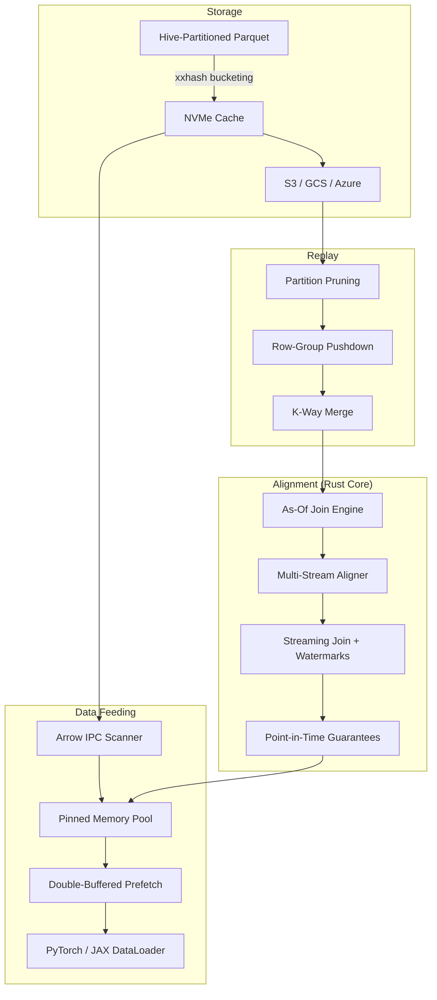

<p align="center">
  <strong>FlowState</strong><br>
  <em>Rust-accelerated temporal alignment engine for quantitative ML</em>
</p>

<p align="center">
  <a href="https://github.com/RyanJHamby/flowstate/actions/workflows/ci.yml"></a>
  <a href="LICENSE"></a>
  <a href="https://www.python.org/downloads/"></a>
</p>

---

FlowState is a Rust-accelerated Python library for building point-in-time correct feature pipelines over market data. It joins heterogeneous streams — trades, quotes, bars — into aligned tensors at nanosecond precision, with optional GPU data feeding for ML training workloads.

Built for production environments where look-ahead bias is a showstopper and pandas doesn't scale.

## The Problem

Quantitative ML models consume multiple data streams that arrive at different frequencies and with different latencies. Aligning them correctly means:

- A trade at `t` should see the most recent quote **as of `t`**, not a future one
- Stale data beyond a tolerance window should be nulled, not silently forward-filled
- Alignment must be per-symbol — AAPL quotes should never bleed into MSFT rows
- The result needs to reach the training loop without unnecessary copies

Most teams solve this with ad-hoc pandas merges, which are slow, error-prone, and disconnected from the training loop. FlowState handles it end-to-end.

## Architecture



## Key Features

| Capability | Description |
|---|---|
| **Rust as-of join kernel** | O(n+m) merge-scan with parallel chunked scan, zero-copy Arrow exchange via PyCapsule Interface |
| **Multi-stream alignment** | Join N secondary streams onto a primary timeline concurrently via Rayon |
| **Streaming incremental joins** | Watermark-based emission with configurable lateness tolerance for real-time feature construction |
| **No look-ahead bias** | Backward joins are the default — each row sees only data available at its timestamp |
| **Arrow IPC I/O** | Rust-native read/write with column projection, batch limiting, and temporal range filtering |
| **Three-level pruning** | Hive partition elimination, Parquet row-group statistics, column projection |
| **K-way merge** | Globally time-ordered iteration across arbitrarily many files without full materialization |
| **GPU data path** | GPUDirect Storage (kvikio) with automatic CPU fallback for dev/CI |
| **ML DataLoaders** | Native PyTorch `IterableDataset` and JAX iterator adapters |
| **Cloud storage** | fsspec backends for S3, GCS, and Azure with NVMe LRU caching |

## Installation

```bash
git clone https://github.com/RyanJHamby/flowstate.git
cd flowstate
pip install -e ".[dev]"
```

```bash
# Build the Rust core (requires Rust toolchain + maturin)
cd flowstate-core
maturin develop --release
```

```bash
# Optional extras
pip install -e ".[gpu]"     # kvikio + cupy for GPUDirect Storage
pip install -e ".[aws]"     # S3 via s3fs
pip install -e ".[gcs]"     # Google Cloud Storage via gcsfs
```

## Usage

### Align trades with quotes (no look-ahead bias)

```python
from flowstate.prism.alignment import TemporalAligner

aligner = TemporalAligner(
    primary_type="trade",
    secondary_specs={
        "quote": ["bid_price", "ask_price", "bid_size", "ask_size"],
    },
    tolerance_ns=5_000_000_000,  # reject quotes older than 5s
)

aligner.add_data("trade", trade_table)
aligner.add_data("quote", quote_table)

aligned, stats = aligner.flush()
# aligned is a pa.Table: trades + quote_bid_price, quote_ask_price, ...
# Every row is point-in-time correct
```

### Low-level as-of join

```python
from flowstate.prism.alignment import as_of_join, AsOfConfig

# Each trade gets the most recent quote as of its timestamp
result, stats = as_of_join(trades, quotes, on="timestamp", by="symbol")

# Forward join for label generation (e.g., mid-price 1 minute ahead)
cfg = AsOfConfig(direction="forward", tolerance_ns=60_000_000_000)
labeled, stats = as_of_join(trades, future_mid, config=cfg)
```

### Streaming incremental join

```python
import flowstate_core

aligner = flowstate_core.StreamingJoin(
    on="timestamp", by="symbol", direction="backward",
    tolerance_ns=5_000_000_000, lateness_ns=1_000_000_000,
)

# Push data as it arrives
aligner.push_right(quote_batch)
aligner.push_left(trade_batch)
aligner.advance_watermark(current_time_ns)

result = aligner.emit()  # emits rows sealed by watermark
```

### Arrow IPC file I/O

```python
import flowstate_core

# Write aligned data to IPC for fast replay
flowstate_core.write_ipc(aligned_table, "/data/aligned/trades.arrow")

# Read with column projection (only load what you need)
table = flowstate_core.read_ipc("/data/aligned/trades.arrow", projection=[0, 1, 3])

# Time-range filtered read
table = flowstate_core.read_ipc_time_range(
    "/data/aligned/trades.arrow",
    on="timestamp", min_ts=1705320000_000_000_000, max_ts=1705406400_000_000_000,
)
```

### Replay historical data with pruning

```python
from flowstate import ReplaySession

session = (
    ReplaySession("/data/market")
    .symbols(["AAPL", "MSFT"])
    .data_types(["trade"])
    .time_range(start_ns=1705320000_000_000_000)
    .batch_size(65_536)
)

for batch in session:
    prices = batch.column("price").to_numpy()
```

## Performance

| Component | Metric | Notes |
|---|---|---|
| Rust as-of join (ungrouped) | 7ms @ 1M rows | O(n+m) merge-scan, parallel chunked scan at 5M+ |
| Rust as-of join (grouped) | 18ms @ 1M rows, 1K symbols | ahash grouping, Rayon parallel per-group joins |
| Multi-stream alignment | Beats Polars at 8+ streams | Rayon `par_iter` over independent joins |
| Streaming join | Watermark-based emission | Configurable lateness tolerance, per-symbol state |
| Arrow IPC I/O | Parallel multi-file scan | Column projection, temporal range filtering |
| Replay | Three-level pruning | 10-100x speedup over full scan on partitioned data |
| Ring buffer | >10M msg/sec | SPSC, shared-memory, cache-line padded |
| Storage | zstd-compressed Parquet | Deterministic Hive partitioning via xxhash |

## Rust Core (`flowstate-core/`)

3,800 lines of Rust exposed to Python via PyO3 + maturin.

```
flowstate-core/
├── src/
│   ├── lib.rs                  # PyO3 module: joins, streaming, IPC
│   ├── ipc.rs                  # Arrow IPC read/write/scan with projections
│   └── asof/
│       ├── scan.rs             # O(n+m) merge-scan kernels (backward/forward/nearest)
│       ├── parallel_scan.rs    # Chunked parallel scan with binary-search cursors
│       ├── join.rs             # Orchestration: sort-detect, ahash grouping, Rayon dispatch
│       ├── gather.rs           # Parallel column gather via Arrow take()
│       ├── multi.rs            # Multi-stream parallel alignment
│       ├── streaming.rs        # Watermark-based streaming join engine
│       └── config.rs           # Direction enum + config struct
├── tests/
│   └── correctness.rs          # 11 proptest property-based invariant tests
└── benches/
    └── asof_bench.rs           # Criterion benchmarks (sequential vs parallel, all directions)
```

## Python Package (`src/flowstate/`)

```
src/flowstate/
├── prism/
│   ├── alignment.py        # Temporal alignment engine (Rust fast path + Python fallback)
│   ├── replay.py            # Partition-pruned historical replay
│   ├── gpu_direct.py        # GPUDirect Storage + CPU fallback
│   ├── pinned_buffer.py     # CUDA pinned memory pool + CPU fallback
│   ├── prefetcher.py        # Double-buffered async prefetch pipeline
│   ├── gpu_pipeline.py      # End-to-end GPU data feeding pipeline
│   ├── dataloader.py        # PyTorch / JAX adapters
│   └── nccl.py              # Multi-GPU communication
├── schema/
│   ├── types.py             # Arrow-native trade/quote/bar schemas
│   ├── registry.py          # Versioned schema evolution
│   ├── normalization.py     # Zero-copy normalizer, A/B arbitration
│   └── validation.py        # Schema enforcement, sequence gap detection
├── storage/
│   ├── partitioning.py      # xxhash Hive partitioning
│   ├── writer.py            # Partitioned Parquet writer (zstd)
│   ├── cache.py             # NVMe LRU cache
│   └── object_store.py      # fsspec cloud backends
├── firehose/
│   └── ring_buffer.py       # Lock-free SPSC ring buffer
├── ops/
│   ├── metrics.py           # P99 latency, throughput counters
│   ├── alignment.py         # Cache-line aligned allocators
│   └── health.py            # Operational health checks
└── pipeline.py              # Pipeline builder + ReplaySession API
```

## Development

```bash
git clone https://github.com/RyanJHamby/flowstate.git
cd flowstate
python -m venv .venv && source .venv/bin/activate
pip install -e ".[dev]"

# Build Rust core
cd flowstate-core && maturin develop --release && cd ..

# Run all tests
python -m pytest tests/ -v          # 435 Python tests
cd flowstate-core && cargo test --no-default-features  # 59 Rust tests (48 unit + 11 proptest)

# Benchmarks
cargo bench --no-default-features   # Criterion microbenchmarks
python benchmarks/bench_asof_join.py  # Python: FlowState vs Polars
```

## Roadmap

- [x] **Rust as-of join kernel** — PyO3/maturin O(n+m) merge scan, parallel chunked scan
- [x] **Streaming alignment** — Incremental as-of joins with watermark-based emission
- [x] **Arrow IPC scanner** — Zero-copy file I/O with column projection and time-range filtering
- [x] **Pinned memory allocator** — CUDA host-pinned buffer pool with CPU fallback
- [x] **Double-buffered prefetch** — Background thread fills buffer *N+1* while GPU consumes buffer *N*
- [x] **End-to-end GPU pipeline** — Replay, align, prefetch, and deliver tensors in one config
- [ ] **SPSC ring buffer in Rust** — Lock-free single-producer single-consumer with `AtomicU64` ordering
- [ ] **Distributed replay** — File-level sharding across ranks with NCCL barrier sync

## License

Apache License 2.0 — see [LICENSE](LICENSE) for details.
