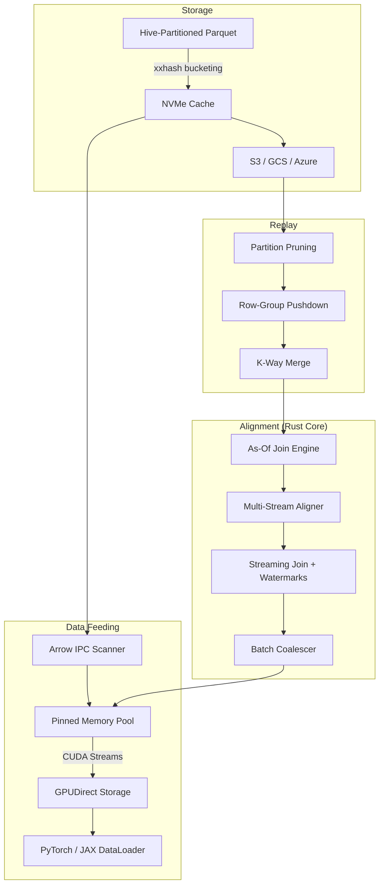

<p align="center">
  <strong>FlowState</strong><br>
  <em>Rust-accelerated temporal alignment engine for quantitative ML</em>
</p>

<p align="center">
  <a href="https://github.com/RyanJHamby/flowstate/actions/workflows/ci.yml"></a>
  <a href="LICENSE"></a>
  <a href="https://www.python.org/downloads/"></a>
</p>

---

FlowState is a Rust-accelerated Python library for building point-in-time correct feature pipelines over market data. It joins heterogeneous streams — trades, quotes, bars — into aligned tensors at nanosecond precision, with GPU-accelerated data feeding via kvikio GPUDirect Storage for ML training workloads.

Built for production environments where look-ahead bias is a showstopper and pandas doesn't scale.

## Architecture



## Performance

Benchmarked on Apple M-series, 1M left × 500K right rows, 1,000 symbols.

| Component | Metric | Detail |
|---|---|---|
| As-of join (ungrouped) | **4 ms** | O(n+m) merge-scan, single-threaded |
| As-of join (grouped) | **10 ms** | ahash grouping → Rayon parallel per-group |
| Parallel chunked scan | **1.2× speedup** at 5M+ | Binary-search cursor starts, disjoint writes |
| Multi-stream (4 streams) | **Parity with Polars** | Rayon `par_iter` over independent joins |
| Multi-stream (8 streams) | **15% faster than Polars** | No equivalent in Polars |
| SPSC ring buffer | **82M elem/s** single-thread | AtomicU64, cache-line padded, 20M/s cross-thread |
| Streaming join | Sub-microsecond emit | Watermark-based, HDR histogram tracked |
| Arrow IPC scan | Parallel multi-file | Column projection, temporal range filtering |

## Key Features

| Capability | Description |
|---|---|
| **Rust as-of join kernel** | O(n+m) merge-scan with parallel chunked scan, zero-copy Arrow exchange via PyCapsule Interface |
| **Streaming incremental joins** | Watermark-based emission with configurable lateness tolerance, batch coalescing |
| **Lock-free infrastructure** | SPSC ring buffer (AtomicU64 Acquire/Release), HDR histogram, Bloom filter |
| **GPU data path** | kvikio `CuFile` for GDS NVMe→GPU bypass, CUDA stream async H2D transfers |
| **Pinned memory pool** | CUDA `cudaMallocHost` with page-aligned CPU fallback, pooled allocation |
| **Multi-stream alignment** | Join N secondary streams concurrently via Rayon |
| **No look-ahead bias** | Backward joins are the default — each row sees only data available at its timestamp |
| **Three-level pruning** | Hive partition elimination → row-group statistics → column projection |
| **ML DataLoaders** | Native PyTorch `IterableDataset` and JAX iterator adapters |
| **Cloud storage** | fsspec backends for S3, GCS, and Azure with NVMe LRU caching |

## Quick Start

```bash
git clone https://github.com/RyanJHamby/flowstate.git && cd flowstate
pip install -e ".[dev]"

# Build the Rust core (requires Rust toolchain + maturin)
cd flowstate-core && maturin develop --release && cd ..

# Optional: GPU support
pip install -e ".[gpu]"   # kvikio + cupy
```

## Usage

### Align trades with quotes

```python
from flowstate.prism.alignment import TemporalAligner

aligner = TemporalAligner(
    primary_type="trade",
    secondary_specs={"quote": ["bid_price", "ask_price"]},
    tolerance_ns=5_000_000_000,
)
aligner.add_data("trade", trade_table)
aligner.add_data("quote", quote_table)

aligned, stats = aligner.flush()
# Every row is point-in-time correct — no look-ahead bias
```

### Streaming incremental join

```python
import flowstate_core

join = flowstate_core.StreamingJoin(
    on="timestamp", by="symbol", direction="backward",
    tolerance_ns=5_000_000_000, lateness_ns=1_000_000_000,
)
join.push_right(quote_batch)
join.push_left(trade_batch)
join.advance_watermark(current_time_ns)

result = join.emit()  # rows sealed by watermark
```

### Arrow IPC I/O

```python
import flowstate_core

flowstate_core.write_ipc(table, "aligned.arrow")
table = flowstate_core.read_ipc("aligned.arrow", projection=[0, 1, 3])
table = flowstate_core.read_ipc_time_range("aligned.arrow", on="timestamp", min_ts=t0, max_ts=t1)
```

### GPU data feeding

```python
from flowstate.prism.gpu_direct import GPUDirectReader, GPUDirectConfig

reader = GPUDirectReader(GPUDirectConfig(
    device_id=0,
    num_streams=2,          # async H2D overlap
    gds_task_size=4*1024*1024,
))

# Binary GDS read: NVMe → PCIe DMA → GPU VRAM (zero CPU copies)
gpu_array = reader.read_binary_to_gpu("/data/prices.bin", dtype=np.float32)

# Parquet read → async H2D transfer via CUDA streams
batch = reader.read_batches("trades.parquet")[0]
gpu_batch = reader.to_device(batch, stream_idx=0)
reader.synchronize()
```

## Rust Core

6,400 lines of Rust, 132 tests (121 unit + 11 proptest). Exposed to Python via PyO3 + maturin.

```
flowstate-core/src/
├── lib.rs              # PyO3 module: joins, streaming, IPC bindings
├── asof/
│   ├── scan.rs         # O(n+m) merge-scan kernels (backward/forward/nearest)
│   ├── parallel_scan.rs# Chunked parallel scan, binary-search cursor starts
│   ├── join.rs         # Orchestration: sort-detect, ahash grouping, Rayon dispatch
│   ├── gather.rs       # Parallel column gather via Arrow take()
│   ├── multi.rs        # Multi-stream parallel alignment
│   ├── streaming.rs    # Watermark-based streaming join (~900 lines)
│   └── config.rs       # Direction enum + config struct
├── ipc.rs              # Arrow IPC read/write/scan, column projection, time-range filter
├── spsc.rs             # Lock-free SPSC ring buffer, AtomicU64 Acquire/Release
├── pipeline.rs         # Streaming pipeline: SPSC → join → coalesce → output ring
├── coalesce.rs         # Adaptive batch coalescer, target-row flushing
├── hdr.rs              # HDR histogram, log-linear bucketing, CAS min/max
├── bloom.rs            # Bloom filter, double-hashing, auto-tuned FPR
├── pool.rs             # Slab buffer pool, auto-return, zero-on-drop
└── pinned.rs           # CUDA pinned memory allocator, page-aligned CPU fallback
```

## Testing

```bash
python -m pytest tests/ -v                              # 447 Python tests
cd flowstate-core && cargo test --no-default-features   # 132 Rust tests
cargo bench --no-default-features                       # Criterion benchmarks
```

## Roadmap

- [x] Rust as-of join kernel — O(n+m) merge-scan, parallel chunked scan, ahash grouping
- [x] Streaming alignment — watermark-based emission with configurable lateness
- [x] Arrow IPC scanner — column projection, temporal range filtering, parallel multi-file
- [x] Lock-free infrastructure — SPSC ring buffer, HDR histogram, Bloom filter, buffer pool
- [x] Streaming pipeline — SPSC → join → coalesce → output, HdrHistogram latency tracking
- [x] GPU data path — kvikio GDS reads, CUDA stream async H2D, pinned memory pool
- [ ] Distributed replay — file-level sharding across ranks with NCCL barrier sync
- [ ] Temporal feature store — catalog, materialization, Arrow Flight serving

## License

Apache License 2.0 — see [LICENSE](LICENSE) for details.
