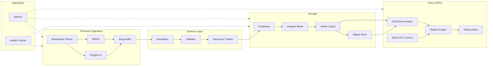

# FlowState

Production-grade Python library for ingesting, normalizing, and storing 100TB+ of market data for GPU-accelerated ML training and historical replay.

[](https://github.com/flowstate-io/flowstate/actions/workflows/ci.yml)
[](LICENSE)
[](https://www.python.org/downloads/)

## Architecture



## Features

- **High-throughput ingestion** — Async WebSocket clients with lock-free shared-memory ring buffers
- **Zero-copy normalization** — Vendor-agnostic Arrow schemas with nanosecond timestamps
- **Schema evolution** — Versioned registry with backward/forward compatibility checks
- **Sequence gap detection** — Per-symbol tracking across feed lines with A/B arbitration
- **Deterministic partitioning** — xxhash-based Hive partitioning prevents hot-symbol skew
- **Parquet + zstd storage** — Columnar format with high compression ratios
- **Tiered storage** — NVMe LRU cache with fsspec-based cloud object store (S3/GCS/Azure)
- **GPU-accelerated replay** — GPUDirect Storage with NCCL multi-GPU support and CPU fallback
- **ML-ready DataLoaders** — PyTorch `IterableDataset` and JAX iterator adapters
- **Operational monitoring** — P99 latency tracking, throughput counters, health checks

## Installation

```bash
pip install flowstate
```

Optional extras:

```bash
pip install flowstate[gpu]     # kvikio + cupy for GPUDirect
pip install flowstate[aws]     # S3 support
pip install flowstate[gcs]     # Google Cloud Storage
pip install flowstate[dev]     # Development tools
```

## Quickstart

### Ingestion Pipeline

```python
from flowstate import Pipeline

pipeline = (
    Pipeline(data_dir="/data/market")
    .add_source("polygon", api_key="YOUR_KEY")
    .subscribe(["AAPL", "MSFT", "GOOG"])
    .build()
)
```

### Historical Replay

```python
from flowstate import ReplaySession

session = (
    ReplaySession("/data/market")
    .symbols(["AAPL"])
    .data_types(["trade"])
    .batch_size(65536)
)

for batch in session:
    prices = batch.column("price").to_numpy()
    # ... your model here
```

### ML Training

```python
from flowstate import ReplaySession

dataset = (
    ReplaySession("/data/market")
    .symbols(["AAPL", "MSFT"])
    .data_types(["trade"])
    .to_dataset(numeric_columns=["price", "size"])
)

for batch in dataset:
    features = batch["price"]  # numpy array
```

### Schema Access

```python
from flowstate import Schema

trade_schema = Schema.trade()
quote_schema = Schema.quote()
bar_schema = Schema.bar()
```

## Performance

| Component | Metric | Target |
|-----------|--------|--------|
| Ring Buffer | Throughput | >10M msg/sec (SPSC) |
| Normalizer | Latency | <1μs per record |
| Parquet Writer | Throughput | >1GB/sec (zstd-3) |
| Replay Engine | Read | >5GB/sec (NVMe) |
| GPUDirect | Transfer | Line-rate NVMe→GPU |

## Development

```bash
git clone https://github.com/flowstate-io/flowstate.git
cd flowstate
python -m venv .venv && source .venv/bin/activate
pip install -e ".[dev]"
python -m pytest tests/ -v
```

## License

Apache License 2.0 — see [LICENSE](LICENSE) for details.
