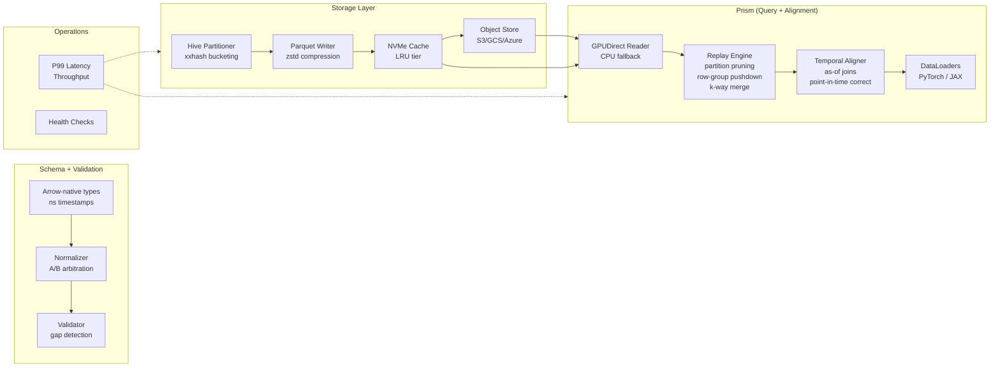

# FlowState

Temporal alignment engine and GPU-accelerated data feeding pipeline for quantitative finance ML. Designed for production use at firms handling 100TB+ of heterogeneous market data.

[](https://github.com/flowstate-io/flowstate/actions/workflows/ci.yml)
[](LICENSE)
[](https://www.python.org/downloads/)

## Why FlowState

Training ML models on market data requires joining trades, quotes, and bars into aligned feature tensors — without look-ahead bias. Existing tools either don't handle nanosecond-precision temporal joins at scale, or force you into slow pandas workflows that don't integrate with GPU training pipelines.

FlowState solves this with:

1. **Point-in-time correct as-of joins** — No look-ahead bias. Each output row contains only data observable at that timestamp.
2. **GPU-aware data feeding** — Pinned memory, double-buffered prefetch, GPUDirect Storage bypass.
3. **Partition-pruned replay** — Hive partition pruning → row-group statistics pushdown → k-way merge for global time ordering. Never loads data you don't need.

## Architecture



## Core Capabilities

### Temporal Alignment

The alignment engine performs point-in-time correct as-of joins across heterogeneous data streams. For each row in the primary timeline (e.g., trades), it finds the most recent observation from each secondary stream (e.g., quotes, bars) that was available at that timestamp.

- **Backward joins** (default) — Forward-fill, no look-ahead bias
- **Forward joins** — For label generation (e.g., future mid-price)
- **Nearest joins** — Closest observation in either direction
- **Configurable tolerance** — Reject stale data beyond a threshold
- **Per-symbol grouping** — Quotes from AAPL never leak into MSFT
- **Multi-stream** — Align any number of secondary streams in one call

### Replay Engine

Production-grade historical data iteration with three levels of pruning:

1. **Hive partition pruning** — Skip entire directories by data type and date
2. **Row-group statistics** — Skip Parquet row groups whose timestamp range doesn't overlap the query
3. **Column projection** — Read only the columns you need

K-way merge across files ensures globally time-ordered output without loading everything into memory.

### Storage

- Deterministic xxhash-based Hive partitioning prevents hot-symbol skew
- Parquet with zstd compression for high compression ratios
- NVMe LRU cache tier with fsspec-based cloud backends (S3/GCS/Azure)

### GPU Integration

- GPUDirect Storage for NVMe→GPU bypass (kvikio) with automatic CPU fallback
- PyTorch `IterableDataset` and JAX iterator adapters
- All GPU features degrade gracefully — runs on CPU in CI/dev

## Installation

```bash
pip install flowstate
```

Optional extras:

```bash
pip install flowstate[gpu]     # kvikio + cupy for GPUDirect
pip install flowstate[aws]     # S3 support
pip install flowstate[gcs]     # Google Cloud Storage
pip install flowstate[dev]     # Development tools
```

## Quickstart

### Temporal Alignment

```python
from flowstate.prism.alignment import TemporalAligner

aligner = TemporalAligner(
    primary_type="trade",
    secondary_specs={
        "quote": ["bid_price", "ask_price", "bid_size", "ask_size"],
    },
    tolerance_ns=5_000_000_000,  # 5 second staleness limit
)

aligner.add_data("trade", trade_table)   # pa.Table with trades
aligner.add_data("quote", quote_table)   # pa.Table with quotes

aligned, stats = aligner.flush()
# aligned: trades with quote_bid_price, quote_ask_price, etc. joined as-of
# No look-ahead bias — each row sees only data available at its timestamp
```

### As-Of Join (Low-Level)

```python
from flowstate.prism.alignment import as_of_join, AsOfConfig

# Backward join: each trade gets the most recent quote
result, stats = as_of_join(trades, quotes, on="timestamp", by="symbol")

# Forward join for label generation
cfg = AsOfConfig(direction="forward", tolerance_ns=60_000_000_000)
result, stats = as_of_join(trades, future_prices, config=cfg)
```

### Historical Replay

```python
from flowstate import ReplaySession

session = (
    ReplaySession("/data/market")
    .symbols(["AAPL", "MSFT"])
    .data_types(["trade"])
    .time_range(start_ns=1705320000_000_000_000)
    .batch_size(65536)
)

for batch in session:
    prices = batch.column("price").to_numpy()
```

### ML Training Pipeline

```python
from flowstate import ReplaySession

dataset = (
    ReplaySession("/data/market")
    .symbols(["AAPL", "MSFT"])
    .data_types(["trade"])
    .to_dataset(numeric_columns=["price", "size"])
)

for batch in dataset:
    features = batch["price"]  # numpy array, GPU-ready
```

## Performance

| Component | Metric | Target |
|-----------|--------|--------|
| As-of Join | Throughput | >1M rows/sec per stream |
| Replay Engine | Read | >5GB/sec (NVMe) |
| Partition Pruning | Speedup | 10-100x vs. full scan |
| GPUDirect | Transfer | Line-rate NVMe→GPU |
| Ring Buffer | Throughput | >10M msg/sec (SPSC) |

## Development

```bash
git clone https://github.com/flowstate-io/flowstate.git
cd flowstate
python -m venv .venv && source .venv/bin/activate
pip install -e ".[dev]"
python -m pytest tests/ -v
```

## Roadmap

- [ ] GPU-aware data feeding — pinned memory allocator, double-buffered prefetch
- [ ] Distributed replay — multi-GPU sharded iteration with NCCL coordination
- [ ] Streaming alignment — incremental as-of joins on live data with watermarks
- [ ] Temporal feature store — materialized aligned views with cache invalidation

## License

Apache License 2.0 — see [LICENSE](LICENSE) for details.
